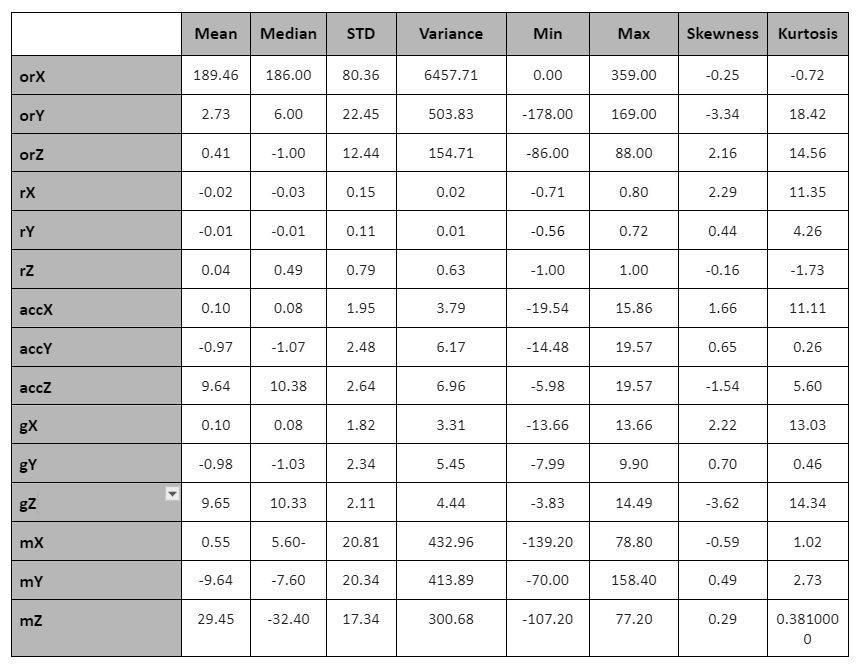

# Activity-Context-Recognition

 

    

## Introduction

Activity Context Recognition is a fundamental aspect of context-aware computing, focused on automatically inferring contextual information from sensor-generated observations. It involves the use of various techniques, including machine learning and data analysis, to analyse sensor data and classify or recognize different activities being performed by individuals. The goal of Activity Context Recognition is to enable systems to understand and respond to users' activities in real-time, allowing for personalised assistance, enhanced user experience, efficient resource management, safety and security, behavioural analysis, adaptive systems, and intelligent applications across domains such as healthcare, smart environments, and lifestyle monitoring.

A fitness company has engaged the services to create an intelligent model for their mobile fitness application, enabling automated recognition of users' activities. The company has provided labelled historical activity context data collected from individuals who have participated in the data collection process. The data encompasses readings from various smartphone built-in sensors, including magnetic, orientation, accelerometer, rotation, gyroscope, light and sound sensors. The objective is to develop an activity recognition model for the fitness system, utilising the activity context tracking dataset to analyse, design, implement, and evaluate the model.

To build the prediction/recognition model, three different Machine Learning Classifier Models are used: **Multi-Layer Perceptron Neural Network**, **Decision Tree Classifier** and **Random Forest Classifier**. 

The necessary steps that are being performed for classification and prediction are mentioned below:

<ul>
  <li>EDA (Exploratory Data Analysis)</li>
  <li>Feature Extraction/Selection</li>
  <li>Activity Classification</li>
</ul>

### 1) EDA (Exploratory Data Analysis)

A labelled historical activity context tracking dataset is used for the purpose of Exploratory Data Analysis, as it incorporates all the attributes that are critical for recognizing human activity. It consists of a total of 23496 observations for 19 different attributes. The various attributes include:

1) **_id:** Id of the observation
2) **orX:** Orientation value along the x-axis
3) **orY:** Orientation value along the y-axis
4) **orZ:** Orientation value along the z-axis
5) **rX:** Rotation around the x-axis
6) **rY:** Rotation around the y-axis
7) **rZ:** Rotation around the z-axis
8) **accX:** Acceleration value on the x-axis
9) **accY:** Acceleration value on the y-axis
10) **accZ:** Acceleration value on the z-axis
11) **gX:** Rate of rotation around the x-axis
12) **gY:** Rate of rotation around the y-axis
13) **gZ:** Rate of rotation around the z-axis
14) **mX:** Magnetic field around the x-axis
15) **mY:** Magnetic field around the y-axis
16) **mZ:** Magnetic field around the z-axis
17) **lux:** Amount of light emitted
18) **soundLevel:** Measure of the sound level
19) **activity:** Activity done by the Human

To ensure the accuracy of machine learning models, it is crucial to address missing or null values, as they can introduce bias in results. Therefore, it is necessary to employ strategies for handling missing values before feeding the dataset into the machine learning or deep learning framework. The dataset does not contain any null values, as no data points are present in the heat map.

    

    <h4> Figure 1.1 HeatMap of the Dataset </h4>

In order to perform the descriptive statistical analysis of the important features, multiple functions have been created. The table below shows the statistical information that has been found out:

    

<ul>
  <li><b> Data Standardisation </b></li>
</ul>

Imbalanced training data poses challenges for machine learning classification problems. The presence of class imbalance significantly biases the models towards the majority class, leading to reduced classification performance and an increased number of false negatives. To mitigate these issues and enhance classification performance, working with a balanced dataset is crucial. A balanced dataset ensures equal consideration of information for predicting each class, providing a more accurate understanding of how the model will respond to test data. Ultimately, this leads to improved classification performance. It is evident from the below plots that the target variable is not normally distributed.

    

    <h4> Figure 1.2 Screenshot of Dataset before Data Standardisation </h4>

    

    <h4> 
Figure 1.3 Bar Chart representing Activity attribute </h4>

Thus, it is necessary to carry out data standardisation and apply relevant techniques to extract meaningful information before feeding it to machine learning algorithms for context recognition, ensuring optimal performance and accurate predictions. Data standardisation is the process of transforming the data in a dataset to a common scale. It is a crucial preprocessing step that enhances the performance and stability of many machine learning algorithms. The most commonly used methods for data standardisation are: normal standardisation, z-score normalisation and  min-max scaling.  In this classification problem, the StandardScaler() function of the scikit-learn is used to standardise the data values into a standard format. The process of standardizing a dataset entails rescaling the distribution of values, aiming to achieve a standard deviation of 1  and a mean of 0 for the observed values.

    

    

    <h4> Figure 1.4 Screenshot of Dataset after Data Standardisation  </h4>

<ul>
  <li><b> SMOTE - Synthetic Minority Oversampling Technique </b></li>
</ul>

This approach involves generating new data by inferring from existing data. Instead of deleting or copying data, current inputs generate distinct rows with labels derived from the implications of the original data.

    

    

    <h4> 
Figure 1.5 Bar Chart representing Activity attribute after SMOTE </h4>

After applying SMOTE on the standardised dataset, the number of rows in the dataset has been increased to 984529. This new dataset is then saved as a new csv file called “standardizedHACR.csv” and then imported for the classification problem wherein it is divided into training & testing sets to overcome the overfitting and underfitting of the training model. 

During the model development process, the training set is employed for model training whereas the testing set comprises of data points that are used to assess the model's generalization to new/unseen data. The scikit-learn library’s train_test_split() method creates the training and testing sets with the test size parameter determining the proportion of the dataset allocated for testing, and the random_state parameter controlling the data shuffling before the split.

### 2) Feature Extraction/Selection

Feature Extraction/Selection is done to identify a subset of relevant features that have a strong relationship with the target variable, leading to improved model performance. It involves assessing the significance of features on model performance for selection purposes. In this dataset, by looking into the heatmap it can be found that the attribute “orZ” is highly correlated to accX.  

Highly correlated features exhibit strong linear dependence and contribute almost equally to the dependent variable. Therefore, when two features display a high correlation, one of the features can be removed to avoid redundancy and multicollinearity. Multicollinearity poses challenges in determining the independent impact of each variable on the target variable. 

Thus, removing highly correlated variables is a crucial step in data preprocessing and improves the performance, efficiency and accuracy of the machine-learning training model. In Python, the correlation matrix is used to identify the pairs of features that are highly correlated and then one of them is dropped from each highly correlated pair. 

corr() - function from the pandas library to calculate the correlation matrix
drop() - function to remove the features with high correlation from the dataframe.

### 3) Classification Models

The Feature Selection stage identifies the most relevant features, which are then utilized in conjunction with the latest balanced dataset for classification models. To classify the data, Machine Learning Algorithms like Decision Tree Classifier, Random Forest Classifier, and Multi-Layer Perceptron Neural Network are employed, using the newly normalized test sets. The effectiveness of these models is assessed by evaluating their performance on the test dataset, yielding confusion matrices for each model. 

A confusion matrix is used to display and summarise the results of a classification algorithm.In case of strong imbalance in test data, there are different evaluation metrics such as Precision, Recall and F1 Score that provides insights apart from the accuracy metric.

Accuracy: It measures the proportion of correct predictions over the total predictions. However, it is not a reliable metric when dealing with unbalanced datasets.
Precision: It should ideally be 1 (high) for a good classifier.
Recall:  It should ideally be 1 (high) for a good classifier.
F1 Score: It encompasses both the precision (accurately identify positive instances) and the recall (capacity to capture all positive instances). It is commonly characterized as the harmonic mean of these two measures.
.
The performances of the models are compared in terms of accuracy, precision, recall & F1-Score.

    

    <h4> 
Figure 3.1 Table showing the performance metrics of the 3 algorithms </h4>

<ul>
  <li> Accuracy of Decision Tree Classifier: 99% </li>
  <li> Accuracy of Random Forest Classifier: 100% </li>
  <li> Accuracy of Multi-Layer Perceptron Neural Network: 86% </li>
</ul>

Based on the results of the above model performances, it can be inferred that Random Forest Classifiers have performed the best following feature selection and the implementation of the SMOTE technique. As a result, the target variable in this classification problem can be predicted with exceptional accuracy of 100%. 

### CONCLUSION & RECOMMENDATIONS 

The project aimed to improve the understanding of various data analytics and visualization libraries used during Exploratory Data Analysis (EDA) for classification purposes. It also focused on dealing with unbalanced datasets by eliminating null values, data standardization, and other techniques to balance it. This resulted in finding and combining different attributes/features and applying various machine learning algorithms to predict the target/output. The context recognition based on sensor data is challenging, especially when there are a variety of machine learning techniques. Human behavior is not only natural and spontaneous, but also humans may perform several activities at the same time or even carry out some unrelated activities. Therefore, it is advised that ACR systems should be designed in such a way that they identify concurrent activities, predict the speed of movement, and deal with uncertainties to achieve high accuracy and improve functionality, quality, and safety in their various applications across industries.

### Libraries used:

<ul>
  <li> Numpy - https://numpy.org/ </li>
  <li> Pandas - https://pandas.pydata.org/ </li>
  <li> Matplotlib - https://matplotlib.org/ </li>
  <li> Seaborn - https://seaborn.pydata.org/ </li>
  <li> Plotly - https://plotly.com/ </li>
  <li> Scikit Learn - https://scikit-learn.org/ </li>
  <li> Keras - https://keras.io/ </li>
</ul>
